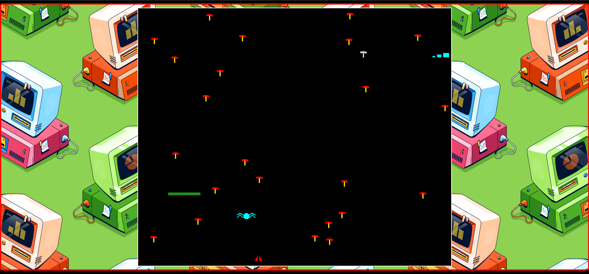

# Centipede

An implementation of Centipede, a vertically oriented fixed shooter arcade game produced by Atari, Inc. in June 1981. The game was designed by Dona Bailey and Ed Logg. The player fights off centipedes, spiders, scorpions, and ants, completing a round after eliminating the centipede that winds down the playing field.

This repo was specifically created because I wanted to learn more about WebAssembly so I ported my implementation of centipede from C++ to WebAssembly. You can read more about this at https://abdullahxz.github.io/posts/centipede-webassembly/

## Getting started

A wasm module is already compiled in the [web](./web/) folder along with the html and js glue code generated by emscripten. You can use any http server to serve these files and get started with playing centipede on web.


1. Install an http server if not already installed.
```bash
npm install --global http-server
```

2. Run the http server to serve files.
```bash
http-server web/ -p 8080 --cors
```

3. Open up a browser and go to http://localhost:8080/game.html

